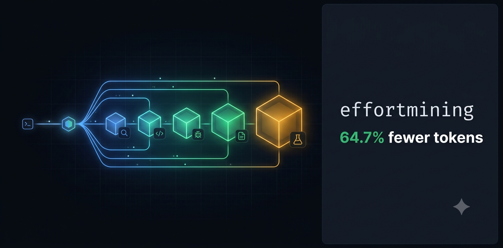

# effortmining


-green)


> Spend the reasoning each subtask deserves — no more, no less.

Claude Code makes every helper agent think as hard as your whole session. Most helpers don't need to. **effortmining right-sizes reasoning effort per subagent and cuts output-token spend ~64.7% with no drop in quality** — measured, not vibes.

## Install

```
claude plugin marketplace add nagisanzenin/effortmining
claude plugin install effortmining@effortmining
```

Requires Python 3 (stdlib only). Start a new session — that's it. It works from the first delegation, nothing to configure.

## The problem, in one picture

Claude Code has a "how hard should I think" dial (`low` → `max`). When it spawns a subagent, that subagent **inherits your session's setting** — there's no way to set effort per spawn. So every helper runs at the same effort, whether it's grepping a file or debugging a crash. And effort costs tokens.

```
  SESSION EFFORT: max        (no per-spawn setting — every helper inherits it)

  grep a file ......... max     <- overkill
  reformat a list ..... max     <- overkill
  read a diff ......... max     <- overkill
  run the tests ....... max     <- overkill
  debug a crash ....... max     <- the only job that actually needed it
```

## What effortmining does

It classifies each subtask, looks up the cheapest effort tier *proven* sufficient for that kind of work, and dispatches a worker pinned at that tier.

```
  effortmining right-sizes each job:

  grep a file ......... low
  reformat a list ..... low
  read a diff ......... low
  run the tests ....... low
  debug a crash ....... high

  four cheap jobs go cheap, the hard one keeps its effort.
  => 64.7% fewer output tokens, same pass rate.
```

**Measured** (~450 pre-registered runs on `claude-opus-4-8`): calibrated dispatch used **64.7% fewer output tokens** (95% CI [60.8, 67.8]) than effort inheritance, at an **identical pass rate**. `max` never beat `xhigh` anywhere. Two pre-registered tests failed and are published below, not buried.

## Why the savings are real

Thinking harder genuinely burns more tokens — but past a point it buys nothing. Median output tokens per tier, across the same tasks, with every tier reaching the quality ceiling:

```
  low    101  ██
  high   158  ███
  xhigh  295  ██████
  max    696  ██████████████   <- 7x low, and it never won a single task
```

`max` doesn't get things wrong — it just costs 7x for the same answer. That gap, multiplied across every subagent your session spawns, is the waste effortmining removes.

## Using it — three modes

- **Ambient (default):** install and forget. A SessionStart hook injects a one-line dispatch policy, and from then on Claude picks the right-effort worker on its own. On a new session you'll see:
  ```
  [effortmining] calibration table 6 cells, fitted 2026-07-07 · /effortmine to dispatch calibrated
  [effortmining] ambient dispatch policy: ... T1-mechanical->miner-low · T3-moderate-reasoning->miner-high ...
  ```
  Watch the task line when Claude delegates — you'll see `miner-low` doing grunt work instead of a full-effort agent. Your explicit effort requests always override the table.

- **Precise:** hand a multi-part job to the orchestrator and watch it decompose:
  ```
  /effortmine (1) extract the domains from these emails into a sorted list: a@x.io, B@y.com, b@y.com
  (2) this function should return the second-largest unique number but breaks on some inputs — find and fix:
  def second_largest(xs): s = sorted(set(xs)); return s[-2]
  ```
  It classifies (1) as mechanical → `miner-low`, (2) as diagnosis → `miner-high`, dispatches both, and tells you why.

- **Measured:** `/effort-bench` — re-run the benchmark on your own account, or refit the table for a different model with `python3 bench/effort.py calibrate`. The whole pipeline is deterministic and resumable.

## How it works (the whole trick)

**1. Five workers, one line apart.** Claude Code's Agent tool has no per-spawn effort parameter — you can override a subagent's `model`, not its effort (verified against the CLI binary and docs, see `docs/research/`). The only place effort can be set is an agent's definition file. So effortmining ships five workers that are byte-identical except one frontmatter line:

```
  agents/  — pick a tier by picking a file:

  miner-low.md     ->  effort: low
  miner-medium.md  ->  effort: medium
  miner-high.md    ->  effort: high
  miner-xhigh.md   ->  effort: xhigh
  miner-max.md     ->  effort: max
```

That indirection is the entire mechanism. No hidden API.

**2. A measured cheat-sheet.** `calibration.json` maps task classes to the cheapest tier that passed a benchmark at that class's quality ceiling. It ships fitted from real runs, carries its own provenance (model, run counts, date), and — where its fitting tasks proved too easy — carries machine-readable warnings that route genuinely hard work up to `xhigh`.

**3. A self-correcting loop.** A SessionStart hook injects the table as policy; a fail-open PostToolUse hook logs every dispatch locally; `effort.py calibrate` refits the table from graded receipts under guarded rules (min-sample gates, single-step moves, clamps). Refit the table and the injected policy updates itself.

```
 request → classify (T1..T4, R, C) → calibration.json → miner-<tier> → result
                                          ↑                    │
                             guarded refit ← graded benchmark receipts
```

## What the data says

> _Headline (pre-registered, could have failed) — **HELD**:_ a class-calibrated effort policy used **64.7% fewer output tokens** (95% CI [60.8, 67.8]) than the status-quo inheritance policy (every subagent at `xhigh`), at **equal** aggregate pass rate (1.000 vs 1.000), and was un-dominated against uniform-`high` and uniform-`low` too.

The shipped 6-class table and the evidence behind each row:

| class | the work | evidence (pass rate) | dispatches to |
|---|---|---|---|
| T1-mechanical | extraction, reformatting | 9/9 at `low` | `miner-low` |
| T2-simple-transform | small well-specified transforms | 9/9 at `low` | `miner-low` |
| T3-moderate-reasoning | diagnosis, logic, tracing | 6/9 at `low` → 9/9 at `high` | `miner-high` |
| T4-hard-reasoning | adversarial multi-step | 9/9 at `low` † | `miner-low` † |
| R-research | cross-document synthesis | 18/18 at `low` isolated † | `miner-low` † |
| C-coding | implement/fix vs hidden tests | 16/18 at `low` → 18/18 at `medium` (refit) | `miner-medium` |

† ships with a **fit-blindness warning**: these fitting tasks saturated (too easy for Opus 4.8), so the ambient policy routes *genuinely hard* instances in these classes to `miner-xhigh` instead. That caveat is measured, not decorative — see finding 3.

**Three findings worth your time:**

1. **Cost climbs even when quality doesn't.** Median output tokens per tier: `low` 101 → `high` 158 → `xhigh` 295 → `max` 696. `max` never improved a single pass rate over `xhigh` — it saturates, it doesn't regress.
2. **Genuinely tier-demanding tasks exist but are rare and specific.** A diagnosis class (T3), a formal-invariant coding task (breaks `low`, fixed by the refit moving C-coding to `medium`), and one research question that only `xhigh` reliably solves — and only when embedded in a bigger job (difficulty turned out to be *contextual*: the same question passes at `low` in isolation).
3. **Low effort doesn't just skim — it fabricates.** In the composite test's one persistent failure, the model at `low` invented a plausible ticket ID that appears nowhere in its documents. This is why the warnings and the `xhigh` route exist.

Two pre-registered composite tests returned **no-win verdicts and are published as such** — the full chronological record (pilot → v2 → refit, including both failures and what they taught) is in [`docs/BENCHMARK-STORY.md`](docs/BENCHMARK-STORY.md); machine-generated reports in [`bench/RESULTS.md`](bench/RESULTS.md) and [`bench/RESULTS-v2.md`](bench/RESULTS-v2.md).

## Honest claims

- **The knob is Anthropic's, shipped.** Per-subagent `effort:` frontmatter exists; effortmining invents no capability — it operates the knob from measurements.
- **Auto-calibration is an open, recurring request** — Claude Code [#43083](https://github.com/anthropics/claude-code/issues/43083) (open), #37783, #25669; OpenAI Codex #8649; OpenCode #21483. Only *model* is configurable per spawn today; effort is not.
- **The closest research is Ares** (arXiv 2603.07915) — per-step effort routing, unshipped. effortmining differs in granularity (per subagent role), method (offline pre-registered A/B), and the fact that you can install it.
- **The economics are real:** multi-agent systems use ~15x chat tokens and token spend explains ~80% of performance variance (Anthropic's own engineering data). A handful of recurring subagent roles carries most of the waste.

## Caveats, honestly

n = 3 reps per cell (confidence is labeled `low` by design; intervals are wide); one model (`claude-opus-4-8` — re-fit per model, it's one command); self-contained tasks that may be easier than your real work — the misclassification checks flag exactly where that's true; `auto` and `ultracode` are out of scope by construction (`auto` = the model default = the `high` column; `ultracode` is an orchestration mode that sends `xhigh`, not an API effort level).

## Repo map

```
effortmining/
├── .claude-plugin/            # manifest + marketplace entry
├── agents/                    # miner-low..max (byte-identical except effort:) + blind effort-grader
├── skills/                    # effortmine (calibrated dispatch) · effort-bench (harness driver)
├── hooks/                     # SessionStart policy injection · fail-open dispatch logger
├── bench/                     # effort.py (stdlib harness) · tasks/ + tasks-v2/ · state/calibration.json · RESULTS*.md
└── docs/                      # architecture · BENCHMARK-STORY · research/ (mechanism, literature, methodology)
```

## More from the same workshop

effortmining is the third repo in a family with one shared discipline: *let a deterministic core decide, and never let the producer of work grade it.*

- **[engram](https://github.com/nagisanzenin/engram)** — an evidence-based learning engine: first-principles curricula, generation-first tutoring, blind-graded free recall, FSRS scheduling. This repo's blind grader and guarded refit are engram patterns, transposed.
- **[claude-code-production-grade-plugin](https://github.com/nagisanzenin/claude-code-production-grade-plugin)** — turns "build me X" into a gated multi-agent pipeline with receipts for every phase. effortmining was built *with* it — the receipts are in this repo.

Pattern provenance: `docs/research/03-pattern-mining.md`.

## License

MIT.
